# VocalDine MultiAgent Core

## Overview

This project implements **VocalDine**, a sophisticated, voice-interactive restaurant management system utilizing a multi-agent architecture. Designed for high concurrency and natural language understanding, the system handles customer interactions ranging from initial greetings to reservation management, order processing, and secure payment handling. It leverages state-of-the-art technologies for speech-to-text, text-to-speech, and large language model processing to deliver a seamless user experience.

## System Architecture

The system operates on a modular agent-based workflow where specialized agents handle distinct functional domains. Context is preserved and shared across agent transitions to ensure continuity.

```mermaid
graph TD
    User([User / Customer]) <-->|Voice Stream| LiveKit[LiveKit Server]
    LiveKit <--> Worker[Worker Process]
    
    subgraph "Agent Logic Layer"
        Worker --> Router{Intent Routing}
        Router -->|Initial Contact| Greeter[Greeter Agent]
        
        Greeter -->|"Book a table"| Reservation[Reservation Agent]
        Greeter -->|"Place order"| Takeaway[Takeaway Agent]
        Greeter -->|"Pay bill"| Checkout[Checkout Agent]
        
        Reservation -->|Complete/Cancel| Greeter
        Takeaway -->|Complete/Cancel| Greeter
        Takeaway -->|Proceed to Pay| Checkout
        Checkout -->|Complete| Greeter
    end
    
    subgraph "External Services"
        Greeter & Reservation & Takeaway & Checkout -.-> STT[Deepgram STT]
        Greeter & Reservation & Takeaway & Checkout -.-> LLM[OpenAI/OpenRouter LLM]
        Greeter & Reservation & Takeaway & Checkout -.-> TTS[ElevenLabs TTS]
    end
```



## Features

*   **Specialized Agent Orchestration**: Distinct agents for Greeting, Reservations, Takeaway, and Checkout, each with specific instructions and toolsets.
*   **Context Preservation**: Seamless transfer of conversation history and user data (names, orders, preferences) between agents.
*   **Real-time Voice Processing**: Low-latency full-duplex voice interaction capabilities.
*   **Concurrent Session Management**: Custom worker pool implementation to handle multiple simultaneous customer calls.
*   **SIP Telephony Support**: Integration capabilities for standard telephony systems.

## Technology Stack

*   **Runtime Environment**: Python 3.8+
*   **API Framework**: FastAPI
*   **Real-time Transport**: LiveKit
*   **Language Models**: OpenAI GPT-4 / OpenRouter
*   **Speech Services**:
    *   **Synthesis (TTS)**: ElevenLabs
    *   **Recognition (STT)**: Deepgram
    *   **Voice Activity Detection (VAD)**: Silero

## Project Structure

The codebase is organized to separate concerns between server infrastructure, business logic, and definitions.

```text
root/
├── backend/
│   ├── definitions/    # Data models and session data
│   │   └── session_data.py
│   ├── logic/          # Agent implementations
│   │   ├── agent_base.py
│   │   └── agent_impl.py
│   ├── server/         # FastAPI application and route endpoints
│   │   └── api_routes.py
│   ├── jobs/           # Background job processors
│   ├── helpers/        # Utility functions and shared tools
│   │   └── utils.py
│   ├── app_entry.py    # API Server entry point
│   └── voice_service.py # Voice Agent Worker entry point
├── .env                # Environment configuration
├── requirements.txt    # Python dependencies
└── README.md           # Documentation
```

## Installation & Setup

1.  **Clone the Repository**
    ```bash
    git clone https://github.com/your-username/vocaldine-multiagent-core.git
    cd vocaldine-multiagent-core
    ```

2.  **Initialize Virtual Environment**
    ```bash
    python -m venv venv
    # Linux/MacOS
    source venv/bin/activate
    # Windows
    venv\Scripts\activate
    ```

3.  **Install Dependencies**
    ```bash
    pip install -r requirements.txt
    ```

4.  **Configuration**
    Create a `.env` file in the project root with the following keys:
    ```ini
    # LiveKit Configuration
    LIVEKIT_URL=wss://your-project.livekit.cloud
    LIVEKIT_API_KEY=your_api_key
    LIVEKIT_API_SECRET=your_api_secret

    # Voice & LLM Configuration
    OPENAI_API_KEY=your_openai_key
    ELEVEN_API_KEY=your_elevenlabs_key
    
    # Optional: OpenRouter Base URL if using OpenRouter
    OPENAI_BASE_URL=https://openrouter.ai/api/v1
    ```

## Usage Guidelines

The system consists of two primary components that must run simultaneously: the API Server and the Voice Worker.

### 1. Start the API Server
This service handles HTTP requests, token generation, and system monitoring.
```bash
python backend/app_entry.py
```
*   **Access**: The API will be available at `http://localhost:8000`.
*   **Documentation**: Swagger UI is available at `http://localhost:8000/docs`.

### 2. Start the Voice Worker
This process connects to the LiveKit cloud and manages the real-time AI agents.
```bash
python -m backend.voice_service dev
```
*   **Note**: Ensure your `.env` file is correctly configured before starting the worker.

## API Endpoints Overview

| Method | Endpoint | Description |
| :--- | :--- | :--- |
| `POST` | `/token` | Generates a connection token for a new room session. |
| `GET` | `/workers/status` | Returns the current health and load status of all active workers. |
| `POST` | `/sip/connect` | Initiates a SIP trunk connection for telephony integration. |
| `POST` | `/sip/dispatch-rule`| Configures routing rules for incoming SIP calls. |

## Outputs and Logging

The system provides structured logging for observability.

*   **Server Logs**: Output to stdout, detailing HTTP request status and server health.
*   **Worker Logs**: Detail agent state transitions, tool usage, and potential errors in conversation logic.

Example Worker Output:
```text
INFO:root:Connected to room: restaurant-room-123
INFO:restaurant-example:entering task Greeter
INFO:restaurant-example:entering task Reservation
INFO:root:Agent session started successfully
```

## License

Copyright (c) 2024 Swetank. All rights reserved.
This project is licensed under the MIT License - see the LICENSE file for details.

---

## Detailed Features

The VocalDine Core encompasses a range of advanced capabilities designed for robust voice interaction:

*   **Multi-Modal Context Switching**: The system intelligently router users between `Greeter`, `Reservation`, `Takeaway`, and `Checkout` agents based on natural language intent.
*   **Intelligent Tool Use**: Agents are equipped with function tools (e.g., `update_name`, `confirm_reservation`) to perform actions and persist data.
*   **Session Data Persistence**: The `UserData` class tracks customer details throughout the call, ensuring that information like name, phone number, and order details are not lost when switching agents.
*   **Dynamic Voice Assignment**: Each agent utilizes a distinct voice personality (via ElevenLabs Voice IDs) to provide audio cues about the change in context.
*   **SIP & Telephony Integration**: Built-in endpoints to manage SIP trunks and dispatch rules, allowing the AI to answer calls from standard phone networks.

## Detailed Environment Variables

Ensure all necessary environment variables are set for the application to function correctly.

| Variable Name | Description | Required | Example |
| :--- | :--- | :--- | :--- |
| `LIVEKIT_URL` | WebSocket URL for your LiveKit instance. | Yes | `wss://project-id.livekit.cloud` |
| `LIVEKIT_API_KEY` | API Key for LiveKit authentication. | Yes | `APIStatus...` |
| `LIVEKIT_API_SECRET` | Secret Key for LiveKit authentication. | Yes | `jc...` |
| `ELEVEN_API_KEY` | API Key for ElevenLabs TTS service. | Yes | `xi...` |
| `OPENAI_API_KEY` | API Key for OpenAI (or OpenRouter) LLM. | Yes | `sk-...` |
| `OPENAI_BASE_URL` | Base URL for LLM API (optional, for OpenRouter). | No | `https://openrouter.ai/api/v1` |

## Detailed API Reference

The API includes endpoints for session management, worker monitoring, and SIP configuration.

### Session Management
*   **`POST /token`**: Create a new room and generate an access token for a client.
    *   *Body*: `{"user_id": "string", "room_name": "string"}`
    *   *Returns*: JSON containing the JWT token and connection details.

### Worker Management
*   **`GET /workers/status`**: View the global status of the worker pool, including active workers and metrics.
*   **`GET /worker/status`**: Check the status of the specific worker instance serving the API request.
*   **`GET /worker/health`**: Simple health check for container orchestration (k8s/docker).

### SIP Integration (Telephony)
*   **`POST /sip/connect`**: Create a SIP inbound trunk.
    *   *Body*: `{"room_name": "string", "phone_numbers": ["+1555..."]}`
*   **`POST /sip/dispatch-rule`**: Create a routing rule for SIP calls.
*   **`GET /sip/dispatch-rules`**: List all active dispatch rules.
*   **`GET /sip/inbound-trunk`**: List all configured inbound SIP trunks.
*   **`DELETE /sip/inbound-trunk/{id}`**: Remove a SIP trunk.
*   **`POST /sip/outbound-trunk`**: Configure an outbound SIP trunk.

## AI Test Cases (Interaction Scenarios)

These scenarios represent the core interaction flows the AI is designed to handle.

### Scenario 1: Table Reservation
1.  **User**: "I'd like to book a table."
2.  **System (Greeter)**: Detects intent -> Transfers to **Reservation Agent**.
3.  **System (Reservation)**: "I can help with that. What time would you like to reserve?"
4.  **User**: "7 PM tonight."
5.  **System**: Calls `update_reservation_time("7 PM")` -> "Can I have your name?"
6.  **User**: "John Doe."
7.  **System**: Calls `update_name("John Doe")` -> Confirms details.

### Scenario 2: Takeaway Order
1.  **User**: "I want to order a pizza for pickup."
2.  **System (Greeter)**: Transfers to **Takeaway Agent**.
3.  **System (Takeaway)**: "Sure, what kind of pizza?"
4.  **User**: "Pepperoni."
5.  **System**: Calls `update_order(["Pepperoni Pizza"])` -> "Anything else?"
6.  **User**: "No, that's it."
7.  **System**: "I'll transfer you to checkout." -> Transfers to **Checkout Agent**.

### Scenario 3: Payment Processing
1.  **System (Checkout)**: "Your total is $15. Please provide your card number."
2.  **User**: gives card details.
3.  **System**: Calls `update_credit_card(...)` -> "Payment successful."

## Technologies Used

*   **LiveKit**: Provides the real-time WebRTC infrastructure for low-latency audio streaming.
*   **OpenAI GPT-4o-mini & GPT-4**: Powers the reasoning capabilities of the agents (`gpt-4o-mini` for high-throughput agents like Greeter, `gpt-4` for complex tasks like Takeaway).
*   **ElevenLabs**: Delivers high-quality, ultra-realistic voice synthesis.
*   **Deepgram Nova-3**: Used for fast and accurate Speech-to-Text transcription.
*   **Silero VAD**: On-device Voice Activity Detection to handle user interruptions.

## Contribution

Contributions are welcome!

1.  **Fork the Project**: Create your own copy of the repository.
2.  **Create a Feature Branch**: `git checkout -b feature/AmazingFeature`
3.  **Commit your Changes**: `git commit -m 'Add some AmazingFeature'`
4.  **Push to the Branch**: `git push origin feature/AmazingFeature`
5.  **Open a Pull Request**: Submit your changes for review.

Please ensure all tests pass and your code adheres to the existing style guidelines.
